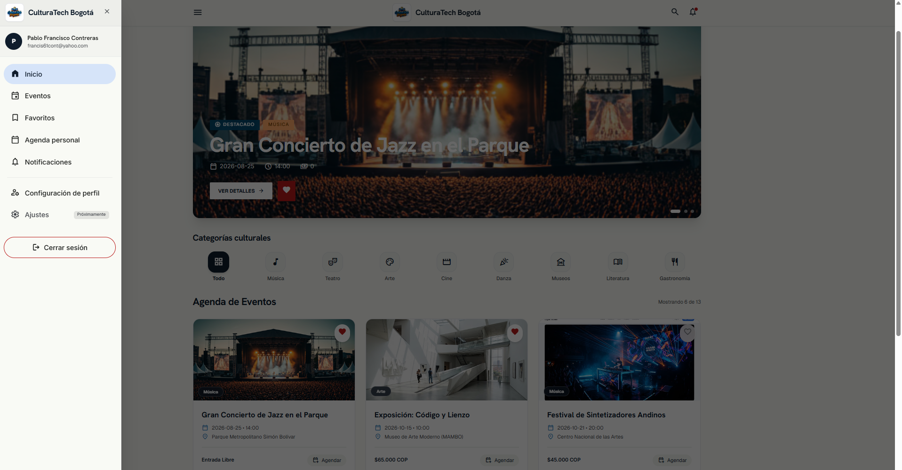
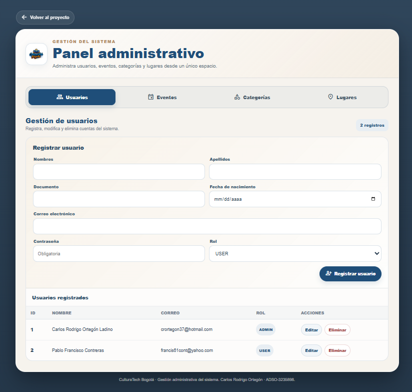
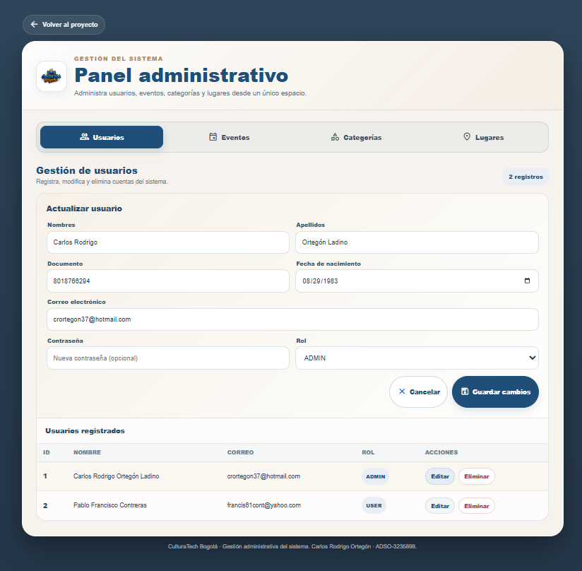
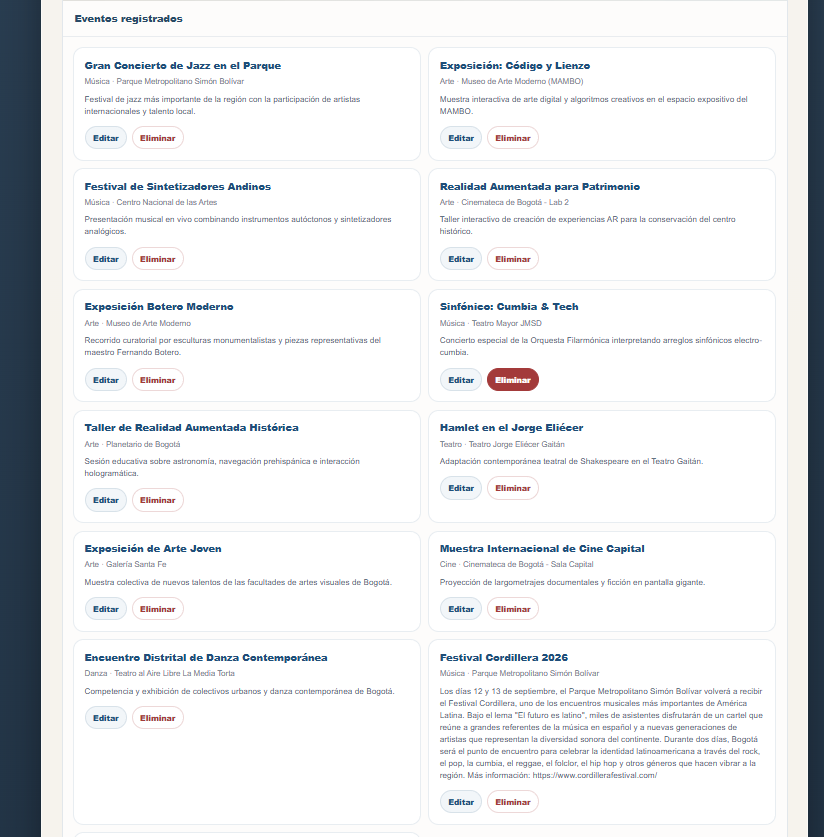

# CulturaTech Bogotá — EV02

## Módulos de software codificados y probados

### 1. Descripción del proyecto

**CulturaTech Bogotá** es una aplicación web orientada a la consulta y gestión de eventos culturales de Bogotá.

El proyecto permite a los usuarios acceder a información relacionada con eventos culturales, consultar su información detallada y utilizar las funcionalidades disponibles de acuerdo con el rol asignado.

La presente versión corresponde a la **Evidencia de Aprendizaje EV02**, en la cual se lleva al entorno web el módulo desarrollado previamente durante la **EV01**, incorporando una capa de interacción mediante páginas HTML, Servlets, métodos HTTP GET y POST, páginas JSP, conexión JDBC con MySQL y funcionalidades administrativas.

EV02 no constituye un proyecto independiente de EV01. Es la **continuidad técnica y funcional del módulo desarrollado anteriormente**, adaptándolo e integrándolo al entorno web.

---

## 2. Continuidad entre EV01 y EV02

El desarrollo del proyecto se realizó de manera progresiva:

```text
EV01
CulturaTechBgCRUD
        │
        │ Java + JDBC + MySQL
        │ CRUD de eventos
        ▼
EV02
CulturaTechBgEV02
        │
        │ Integración web
        │ HTML + Servlets
        │ GET + POST
        │ JSP
        │ JDBC + MySQL
        │ Autenticación y roles
        │ Panel administrativo
        ▼
Módulo web de CulturaTech Bogotá
```

### EV01

En la EV01 se desarrolló el módulo base del sistema utilizando:

* Java.
* JDBC.
* MySQL.
* Modelo de datos.
* DAO.
* Operaciones CRUD.
* Estándares de programación.
* Versionamiento mediante Git.

El módulo desarrollado permitió realizar las operaciones principales sobre los eventos:

* Crear.
* Consultar.
* Actualizar.
* Eliminar.

El CRUD fue conectado directamente con la base de datos `culturatechbg`.

La documentación de EV01 registra que las operaciones INSERT, READ, UPDATE y DELETE fueron verificadas y que el proyecto fue versionado mediante Git.

### EV02

La EV02 toma como base el trabajo realizado en EV01 y lo incorpora a una aplicación web.

En esta etapa se agregaron:

* Páginas HTML.
* Formularios.
* Servlets.
* Procesamiento mediante GET.
* Procesamiento mediante POST.
* Elementos JSP.
* Integración con JDBC.
* Conexión con MySQL.
* Autenticación de usuarios.
* Manejo de roles.
* Acceso diferenciado para usuarios y administradores.
* Panel Administrativo.
* Gestión de información mediante el CRUD desde la interfaz web.

De esta manera, el CRUD desarrollado en EV01 se mantiene como parte de la lógica del proyecto y en EV02 se incorpora la interacción mediante la capa web.

---

## 3. Versionamiento y ramas

El desarrollo de EV02 se realizó mediante control de versiones con Git.

La continuidad del desarrollo se estableció a partir de la versión correspondiente a EV01.

La estructura de trabajo utilizada es:

```text
MAIN
 │
 └── EV02
      
```

La rama utilizada para el desarrollo de la presente evidencia es:

```text
EV02
```

La rama `EV02` contiene la evolución del proyecto correspondiente a la evidencia actual, tomando como punto de partida el trabajo desarrollado anteriormente en EV01.

Por lo tanto:

* **EV01:** contiene el módulo Java/JDBC/CRUD desarrollado inicialmente.
* **EV02:** contiene la adaptación e integración web del módulo.
* **EV02:** incorpora las funcionalidades requeridas para la interacción mediante HTML, Servlets, GET, POST y JSP.

El objetivo de esta organización es mantener la trazabilidad del desarrollo y demostrar que EV02 corresponde a la continuidad del módulo anterior y no a un desarrollo aislado.

---

## 4. Tecnologías utilizadas

El proyecto utiliza las siguientes tecnologías:

| Tecnología      | Utilización                                     |
| --------------- | ----------------------------------------------- |
| Java            | Lógica de aplicación                            |
| Jakarta Servlet | Procesamiento de solicitudes web                |
| HTML            | Formularios e interfaces web                    |
| JSP             | Presentación y generación de contenido dinámico |
| JavaScript      | Interacción y comportamiento de las interfaces  |
| CSS             | Diseño y presentación visual                    |
| JDBC            | Conexión entre Java y MySQL                     |
| MySQL           | Persistencia de información                     |
| Apache Tomcat   | Servidor de aplicaciones                        |
| Git             | Control de versiones                            |

### Configuración principal

Servidor de aplicaciones:

```text
Apache Tomcat 11.0.25
```

Base de datos:

```text
culturatechbg
```

Conector utilizado:

```text
mysql-connector-j-26.7.0.jar
```

Context path de la aplicación:

```text
/CulturaTechBgEV02
```

La estructura técnica y estas tecnologías corresponden a la versión EV02 registrada durante la revisión del proyecto.

---

## 5. Estructura general del proyecto

La estructura general del proyecto se organiza en capas para separar la presentación, lógica de aplicación y acceso a datos.

```text
CulturaTechBgEV02
│
├── Web Pages
│   ├── META-INF
│   ├── WEB-INF
│   ├── assets
│   ├── css
│   ├── data
│   ├── js
│   ├── pages
│   ├── eventos.jsp
│   └── index.html
│
├── Source Packages
│   ├── dao
│   ├── model
│   ├── servlet
│   └── util
│
├── Libraries
│   └── mysql-connector-j-26.7.0.jar
│
└── Configuration Files
```

La estructura registrada para EV02 contempla los paquetes `dao`, `model`, `servlet` y `util`, junto con las páginas web, JSP, recursos estáticos y las bibliotecas utilizadas por el proyecto.

---

## 6. Conexión con la base de datos

La aplicación utiliza JDBC para establecer comunicación entre Java y la base de datos MySQL.

La base de datos utilizada es:

```text
culturatechbg
```

La conexión permite que los componentes de la aplicación puedan consultar y modificar la información almacenada en la base de datos.

La arquitectura general de comunicación es:

```text
Interfaz web
     │
     ▼
Servlet
     │
     ▼
DAO
     │
     ▼
JDBC
     │
     ▼
MySQL
     │
     ▼
Base de datos culturatechbg
```

Esta estructura permite mantener separadas las responsabilidades de presentación, procesamiento y acceso a datos.

---

## 7. Servlets y procesamiento HTTP

EV02 incorpora Servlets como componente principal para procesar las solicitudes realizadas desde las interfaces web.

Los métodos HTTP utilizados son:

### GET

El método GET se utiliza para realizar solicitudes de consulta y recuperación de información.

Ejemplo de flujo:

```text
Usuario
  ↓
Interfaz web
  ↓
Solicitud GET
  ↓
Servlet
  ↓
DAO
  ↓
MySQL
  ↓
Respuesta
```

### POST

El método POST se utiliza para enviar información desde formularios y realizar operaciones que requieren procesamiento en el servidor.

Ejemplo:

```text
Formulario HTML
       ↓
     POST
       ↓
    Servlet
       ↓
      DAO
       ↓
     MySQL
```

Dentro del proyecto se implementaron Servlets relacionados con el proceso de autenticación, registro, sesión y gestión de eventos.

Entre los componentes registrados se encuentran:

* `LoginServlet`
* `RegistroServlet`
* `AuthSessionServlet`
* `LogoutServlet`
* `EventoServlet`

El desarrollo de EV02 incorpora específicamente la utilización de Servlets, formularios HTML, GET, POST y JSP, de acuerdo con el alcance establecido para la evidencia.

---

## 8. Utilización de JSP

Las páginas JSP se utilizan como parte de la capa web para presentar información dinámica generada a partir de los datos procesados por la aplicación.

Dentro del proyecto se encuentra:

```text
eventos.jsp
```

El flujo general es:

```text
Solicitud del usuario
        ↓
      Servlet
        ↓
       DAO
        ↓
      MySQL
        ↓
      Servlet
        ↓
       JSP
        ↓
   Información web
```

Esto permite integrar la información obtenida desde la base de datos con la presentación web.

---

# 9. Acceso según rol de usuario

EV02 incorpora un manejo diferenciado de acceso de acuerdo con el rol asignado al usuario.

Se contemplan principalmente dos tipos de acceso:

```text
                  Inicio de sesión
                          │
                          ▼
                  Usuario autenticado
                          │
                  ┌────────┴────────┐
                  │               │
                USER            ADMIN
                  │               │
                  ▼              ▼
          Interfaz de usuario   Panel Administrativo
```

El objetivo es que cada usuario acceda a las funcionalidades correspondientes a su rol.

---

## 10. Rol USER — Usuario

El usuario con rol **USER** tiene acceso a las funcionalidades destinadas a la consulta y navegación de la aplicación.

El recorrido principal contempla:

```text
Inicio de sesión
      ↓
Configuración / Perfil
      ↓
Home / Inicio
      ↓
Eventos
      ↓
Detalle del evento
```

Desde la interfaz correspondiente al usuario se puede acceder a:

* Home / Inicio.
* Eventos.
* Detalle de eventos.
* Configuración / Perfil.
* Funcionalidades disponibles para el usuario autenticado.


### Evidencia visual — acceso del usuario

Capturas correspondientes al flujo de acceso del usuario.

**Imagen 1 — Acceso y perfil del usuario**


**Imagen 2 — Home / Inicio**



**Imagen 3 — Listado de eventos**


**Imagen 4 — Detalle del evento**


Estas imágenes permiten evidenciar visualmente el recorrido del usuario desde su acceso hasta la consulta de eventos y sus respectivos detalles.


# 11. Rol ADMIN — Administrador

El rol **ADMIN** dispone de un acceso adicional orientado a la administración de la información gestionada por el sistema.

El flujo principal es:

```text
Inicio de sesión
      ↓
Validación del usuario
      ↓
Validación del rol ADMIN
      ↓
Panel Administrativo
      ↓
Interfaces administrativas
```

El Panel Administrativo permite acceder a las interfaces destinadas a la gestión de la información.

Entre las funcionalidades administrativas desarrolladas se encuentra la gestión de información mediante operaciones CRUD.

El objetivo del panel es proporcionar una interfaz web para realizar las operaciones de administración que anteriormente se ejecutaban desde el módulo Java/JDBC desarrollado en EV01.

---

## 12. CRUD administrativo

El CRUD administrativo mantiene la continuidad funcional con el CRUD desarrollado en EV01.

Las operaciones son:

| Operación | Acción                       |
| --------- | ---------------------------- |
| CREATE    | Crear / insertar información |
| READ      | Consultar información        |
| UPDATE    | Actualizar información       |
| DELETE    | Eliminar información         |

El flujo de la operación es:

```text
Panel Administrativo
        ↓
Formulario / Interfaz
        ↓
Servlet
        ↓
DAO
        ↓
JDBC
        ↓
MySQL
```

La información modificada mediante el panel administrativo debe reflejarse en la base de datos.

En el caso de los eventos, la información administrada puede posteriormente ser consultada desde la interfaz web destinada a los usuarios.

La documentación de control de EV02 establece como comprobación importante que las operaciones administrativas de crear, editar y eliminar se realicen desde la interfaz y que posteriormente se verifiquen los cambios directamente en MySQL.

---

## 13. Evidencia visual — Panel Administrativo

Capturas correspondientes exclusivamente al rol ADMIN.

**Imagen 5 — Acceso como administrador**


**Imagen 6 — Gestión administrativa de eventos**


**Imagen 7 — Formulario administrativo**



**Imagen 8 — Edición de información**



**Imagen 9 — Eliminación de información**



---

# 14. Autenticación

El proyecto incorpora un flujo de autenticación para controlar el acceso a las funcionalidades de la aplicación.

El proceso general es:

```text
Registro
   ↓
Autenticación
   ↓
Validación
   ↓
Sesión
   ↓
Acceso según rol
```

El proyecto contempla componentes para:

* Registro.
* Inicio de sesión.
* Validación mediante OTP.
* Creación de sesión autenticada.
* Cierre de sesión.

Las contraseñas se manejan mediante un proceso de hash basado en:

```text
PBKDF2WithHmacSHA256
```

utilizando salt y hash, evitando almacenar las contraseñas directamente en texto plano.

---

# 15. Modelo de datos

La aplicación utiliza la base de datos:

```text
culturatechbg
```

Entre las tablas utilizadas por el proyecto se encuentran:

```text
categoria
lugar
evento
usuario
agenda_personal
favorito
notificacion
```

Las relaciones principales para la gestión de eventos incluyen:

```text
categoria
    │
    │ id_categoria
    ▼
evento
    │
    │ id_lugar
    ▼
lugar
```

La tabla `usuario` permite almacenar la información de los usuarios y su rol dentro del sistema.

---

# 16. Pruebas realizadas

Como parte del proceso de desarrollo se realizaron verificaciones de funcionamiento sobre los diferentes componentes del proyecto.

Las pruebas contemplan:

### Base de datos

* Conexión mediante JDBC.
* Acceso a MySQL.
* Consulta de información.
* Verificación de cambios realizados mediante el sistema.

### Autenticación

* Registro.
* Inicio de sesión.
* Validación de sesión.
* Validación del rol.
* Cierre de sesión.

### Módulo web

* Acceso mediante navegador.
* Formularios HTML.
* Solicitudes GET.
* Solicitudes POST.
* Procesamiento mediante Servlets.
* Presentación mediante JSP.

### CRUD

* Crear.
* Consultar.
* Actualizar.
* Eliminar.

### Panel Administrativo

* Acceso mediante rol ADMIN.
* Visualización de las interfaces administrativas.
* Gestión de información.
* Verificación de cambios en MySQL.

---

# 17. Relación entre las capas del sistema

La integración final del módulo puede representarse de la siguiente manera:

```text
                   USUARIO
                      │
                      ▼
                INTERFAZ WEB
                      │
             ┌─────────┴─────────┐
             │                 │
          Rol USER          Rol ADMIN
             │                 │
             ▼                ▼
       Home / Eventos      Panel Administrativo
             │                 │
             └─────────┬─────────┘
                       ▼
                    SERVLET
                       │
                       ▼
                      DAO
                       │
                       ▼
                     JDBC
                       │
                       ▼
                    MySQL
                       │
                       ▼
               culturatechbg
```

Esta estructura permite mantener la continuidad del módulo de datos desarrollado en EV01 y agregar en EV02 la interacción mediante la capa web.

---

# 18. Control de versiones

El proyecto se encuentra gestionado mediante Git.

La rama correspondiente a esta evidencia es:

```text
EV02
```

Los cambios realizados durante EV02 deben quedar registrados mediante commits relacionados con el desarrollo y cierre de la evidencia.

El flujo de trabajo utilizado es:

```text
Desarrollo
    ↓
Pruebas
    ↓
Correcciones
    ↓
Documentación
    ↓
Commit
    ↓
Push
    ↓
Rama EV02
```

La documentación de control de la evidencia establece que, una vez terminada la revisión técnica, debe verificarse el proyecto en la rama `EV02`, realizar el commit final y posteriormente hacer el push al repositorio remoto.

---

# 19. Continuidad técnica EV01 → EV02

La evolución del proyecto puede resumirse de la siguiente forma:

| EV01                                | EV02                 |
| ----------------------------------- | -------------------- |
| Java                                | Java                 |
| JDBC                                | JDBC                 |
| MySQL                               | MySQL                |
| DAO                                 | DAO                  |
| Modelo                              | Modelo               |
| CRUD                                | CRUD                 |
| Aplicación de consola / módulo base | Aplicación web       |
| —                                   | HTML                 |
| —                                   | Servlets             |
| —                                   | GET                  |
| —                                   | POST                 |
| —                                   | JSP                  |
| —                                   | Autenticación        |
| —                                   | Roles                |
| —                                   | Panel Administrativo |

Por lo tanto, EV02 conserva la base técnica desarrollada en EV01 y amplía su funcionamiento mediante una capa web.

---

# 20. Recomendaciones de ejecución

Para ejecutar el proyecto correctamente se requiere contar con:

1. JDK compatible con el proyecto.
2. Apache NetBeans.
3. Apache Tomcat 11.0.25.
4. MySQL Server.
5. Base de datos `culturatechbg`.
6. Conector MySQL JDBC.
7. Configuración de las credenciales locales de MySQL.

Las credenciales utilizadas para conexión local deben corresponder al entorno de desarrollo y no deben publicarse en el repositorio.

Antes de realizar el commit final se debe comprobar que no existan contraseñas reales u otros datos sensibles dentro del código fuente. Esta revisión forma parte de los controles establecidos para el cierre de EV02.

---

# 21. Base de datos y archivo SQL

El proyecto puede incluir opcionalmente un respaldo de la base de datos con su estructura y datos actuales.

Si se incorpora al proyecto, se recomienda organizarlo de la siguiente manera:

```text
CulturaTechBgEV02/
│
├── database/
│   └── culturatechbg.sql
│
└── README.md
```

El archivo SQL permite reconstruir la estructura y, dependiendo del tipo de exportación realizada, los datos existentes en la base de datos.

Este archivo funciona como apoyo para la instalación y recuperación del proyecto y no reemplaza la configuración de conexión JDBC.

---

# 22. Documentación complementaria

La documentación específica relacionada con el CRUD y el Panel Administrativo puede consultarse en:

```text
README_CRUD_ADMIN.md
```

Este archivo contiene información complementaria sobre las funcionalidades administrativas y puede utilizarse como referencia técnica adicional al presente README principal.

---

# 23. Entrega EV02

La entrega de EV02 debe conservar el código fuente correspondiente a la versión final del proyecto y el archivo requerido con el enlace al repositorio.

La estructura de entrega debe corresponder a la versión final revisada del proyecto y no a una copia anterior.

Antes de generar el archivo comprimido se debe comprobar:

* Código fuente actualizado.
* Proyecto funcional.
* Servlets funcionando.
* GET y POST funcionando.
* JSP funcionando.
* Conexión JDBC funcionando.
* Conexión con MySQL funcionando.
* CRUD verificado.
* Acceso de usuario verificado.
* Acceso ADMIN verificado.
* Panel Administrativo verificado.
* Cambios comprobados en la base de datos.
* Rama `EV02` actualizada.
* Commit final realizado.
* Push realizado.
* README actualizado.
* Archivo con enlace al repositorio preparado.
* Credenciales locales protegidas.
* Proyecto final limpio de archivos innecesarios.

La secuencia recomendada para el cierre es:

```text
Proyecto actual de NetBeans
          ↓
Verificación
          ↓
Pruebas
          ↓
README
          ↓
Git
          ↓
Rama EV02
          ↓
Commit
          ↓
Push
          ↓
Verificación del repositorio
          ↓
ZIP final
          ↓
PDF de evidencia
```

Esta secuencia coincide con el orden de control establecido para finalizar EV02.

---

# 24. Conclusión

EV02 representa la continuidad del desarrollo iniciado en EV01.

Mientras que EV01 permitió construir y comprobar el módulo base mediante Java, JDBC, MySQL y operaciones CRUD, EV02 incorpora este desarrollo dentro de un entorno web mediante HTML, Servlets, GET, POST y JSP.

Adicionalmente, se incorporó el manejo de autenticación y roles, permitiendo diferenciar el acceso de usuarios y administradores.

El usuario puede acceder a las interfaces destinadas a la consulta y navegación de eventos, mientras que el administrador dispone del Panel Administrativo para las operaciones de gestión correspondientes.

De esta manera, CulturaTech Bogotá mantiene una evolución progresiva:

```text
Artefactos previos
       ↓
EV01
Java + JDBC + MySQL + CRUD
       ↓
EV02
Web + Servlets + GET + POST + JSP
       ↓
Autenticación + Roles
       ↓
Panel Administrativo
       ↓
Módulo web integrado de CulturaTech Bogotá
```

La presente versión corresponde a la rama `EV02` y constituye la continuidad del trabajo desarrollado en la evidencia anterior.


## Autoría y trazabilidad

**Autor:** Carlos Rodrigo Ortegón
**Correo:** crortegon37@hotmail.com  
**Proyecto:**  ADSO-3235898 CulturaTech Bogotá  
**Año:** 2026